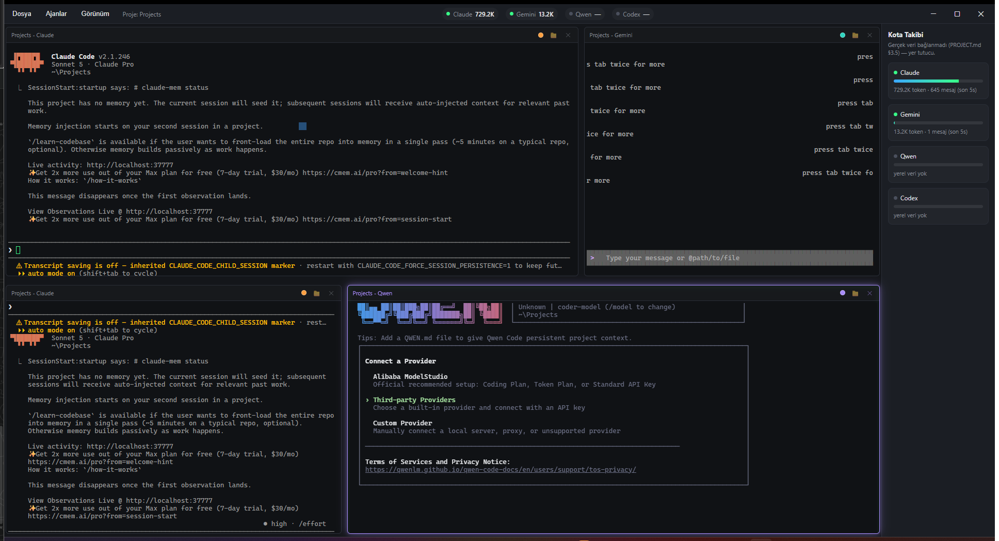
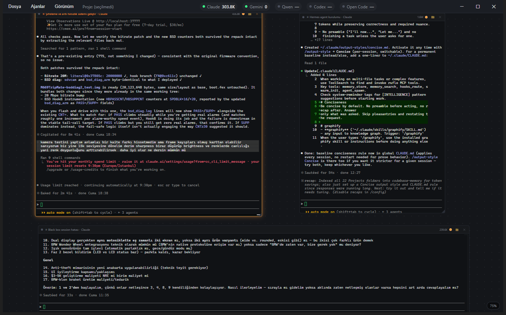

# MultiCli for AI Agent Management

An Electron desktop app that runs multiple AI CLI agents (Claude, Gemini, Qwen, Codex...)
side by side as real terminal panels in a single window.



Canvas view — panels as free-positioned nodes on a pan/zoom surface, each showing its
own live session title and that session's token count:



## Features

- **Directly typable panel grid** — each panel is a real `node-pty` + `xterm.js`
  terminal; click and type into it like any normal terminal. Ctrl+1..8 switches panels,
  PageUp/PageDown/Ctrl+Home/Ctrl+End scroll through history.
- **2D grid, resizable both horizontally and vertically**, double-click to
  maximize/restore a panel.
- **Three layouts** (View → Layout, or Ctrl+Shift+1/2/3) sharing the same live panels:
  the **grid**, an infinite **canvas** you can pan and zoom with panels as
  free-positioned nodes, and a **board** that sorts panels into columns by status.
- **Live agent status** — a dot on every panel head reads *running* / *needs you* /
  *idle* / *exited*, inferred from the terminal stream itself (no agent-side setup).
  When the window isn't focused, an agent asking a question raises an OS notification.
- **Session restore** — the panel list, folders and canvas layout are saved, and on the
  next launch each panel is reopened on *its own* previous conversation (`claude -r <id>`),
  with the old scrollback replayed dimmed above the live output.
- **Per-session token count** in each panel head, read from that panel's own transcript —
  so several panels on the same folder still report separately.
- **Per-panel project folder** — each window can have its own working directory; save
  multiple projects from the File menu and switch between them quickly.
- **Per-agent color** — Claude orange, Gemini turquoise, Qwen purple, Codex green by
  default (or pick your own from the View menu); the active panel gets a green neon
  glow highlight.
- **Real local quota tracking** — for Claude and Gemini, real token usage is read from
  local session files (no network requests at all) and shown live both in the title-bar
  mini indicators and the right-side quota panel.
- **Remote access** (View → Start Remote Access…) — attach to and control your *actual*
  running panels from another PC or phone's browser, over a Tailscale tailnet or plain
  LAN: same sessions, same folders, full control (typing, opening new panels, switching
  projects), not a read-only mirror. Token-gated, no TLS by design (see
  [`PROJECT.md` §3.7](PROJECT.md)).
- **UI language follows the system locale** (TR/EN).
- Frameless, dark theme similar to Claude Desktop.

## Built with

- [Electron](https://www.electronjs.org/) ^44 — the desktop app shell
- [node-pty](https://github.com/microsoft/node-pty) ^1.1 — real pseudoterminal spawning
  (Microsoft's library, N-API based — no native rebuild needed on Windows)
- [xterm.js](https://xtermjs.org/) ^6 (`@xterm/xterm` + `@xterm/addon-fit`) — the
  terminal emulator rendered inside each panel
- [ws](https://github.com/websockets/ws) ^8 — the WebSocket server behind remote access

## Requirements

- **Node.js 18+** (developed and tested on Node 24) and npm
- **Windows** for now — `node-pty`'s prebuilt native binary is only verified on
  win32-x64 in this project; other platforms should work in principle but haven't been
  tested
- The CLI tools you actually want to run (`claude`, `gemini`, `qwen`, `codex`, ...)
  installed and authenticated on your machine — multicli just spawns them as regular
  shell processes, it doesn't bundle or install them

## Setup

```bash
npm install
npm start
```

## Status

Active development (MVP). See [`PROJECT.md`](PROJECT.md) for detailed architecture
notes, decisions, and the roadmap.

## Contributing

This is an early-stage personal project, open-sourced so anyone interested can read the
code, use it, or build on it. Issues and PRs are welcome — there's no formal contribution
process yet, just open one.

## License

[MIT](LICENSE)
